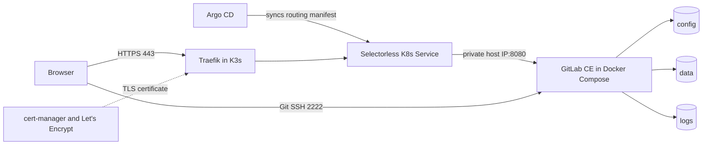

# Self-Hosted GitLab CE on Docker and K3s

[](https://docs.gitlab.com/update/)
[](https://github.com/AntonSatt/gitlab-self-host/actions/workflows/validate.yml)
[](https://git.antonsatt.com/explore/projects/active)

A reproducible, resource-conscious GitLab CE deployment. GitLab itself runs in
Docker Compose while K3s provides Traefik ingress and cert-manager TLS. A
standalone Nginx alternative is included for servers without Kubernetes.

This repository is the public, sanitized guide for the deployment running at
[git.antonsatt.com](https://git.antonsatt.com/explore/projects/active). The
GitOps routing manifest lives in
[sort-my-infra](https://github.com/AntonSatt/sort-my-infra/tree/master/kubernetes/apps/gitlab).

## Architecture deployed on `oracle-1`



GitLab is intentionally not running inside K3s. The official Omnibus container
keeps its PostgreSQL, Redis, Gitaly, Sidekiq, and Rails services together, while
K3s handles the public HTTP entry point shared with the rest of the homelab.

### Audited live state

The live instance was checked and upgraded on 2026-08-01.

| Component | Live configuration |
| --- | --- |
| GitLab | Community Edition 19.2.1, pinned Docker image |
| Runtime | Docker Compose on an ARM64 Oracle Cloud VM |
| Web routing | K3s Traefik to the host's private address on port 8080 |
| TLS | cert-manager with Let's Encrypt |
| Git over SSH | Public port 2222 mapped to the container's port 22 |
| Persistence | Bind mounts for `/etc/gitlab`, `/var/opt/gitlab`, and `/var/log/gitlab` |
| GitOps | Argo CD syncs the Kubernetes routing manifest |

This is a single-node deployment, not a high-availability design.

## Repository contents

```text
.
|-- .env.example                 # Required non-secret settings
|-- docker-compose.yml           # GitLab and resource tuning
|-- kubernetes/gitlab-proxy.yml  # K3s Service, EndpointSlice, and Ingress
|-- nginx.conf.example           # Standalone reverse-proxy alternative
|-- docs/operations.md           # Backups, upgrades, checks, and rollback
|-- .gitlab-ci.yml               # Validation on self-hosted GitLab
`-- .github/workflows/validate.yml
```

Runtime data and `.env` are ignored by Git and must never be committed.

## Requirements

- Ubuntu 22.04 or 24.04 LTS
- Docker Engine and Docker Compose v2
- 2 CPU cores minimum, 4 recommended
- 4 GB RAM minimum, 8 GB or more recommended
- At least 20 GB free disk space
- A domain pointing to the server
- One of these public web entry points:
  - K3s with Traefik and cert-manager
  - Nginx with Certbot

Four GB of swap is useful on smaller machines.

## Quick start

### 1. Configure GitLab

```bash
git clone https://github.com/AntonSatt/gitlab-self-host.git
cd gitlab-self-host
cp .env.example .env
```

Edit `.env`:

```dotenv
GITLAB_VERSION=19.2.1-ce.0
GITLAB_DOMAIN=git.example.com
GITLAB_HTTP_BIND=127.0.0.1
GITLAB_HTTP_PORT=8080
GITLAB_SSH_BIND=0.0.0.0
GITLAB_SSH_PORT=2222
```

Use `127.0.0.1` when Nginx runs on the host. For the K3s design, set
`GITLAB_HTTP_BIND` to the host's private address, then use the same address in
`kubernetes/gitlab-proxy.yml`. Do not expose port 8080 in the cloud firewall.

Validate and start the container:

```bash
docker compose config --quiet
docker compose up -d
docker compose ps
```

The first boot can take 5 to 10 minutes. Follow it with:

```bash
docker compose logs -f gitlab
```

### 2A. Publish through K3s and Traefik

Edit these placeholders in `kubernetes/gitlab-proxy.yml`:

- `10.0.0.10`: the host's private address and `GITLAB_HTTP_BIND`
- `git.example.com`: the public GitLab domain
- `letsencrypt-prod`: your cert-manager ClusterIssuer

Then apply it directly or let Argo CD sync it from your GitOps repository:

```bash
kubectl create namespace apps --dry-run=client -o yaml | kubectl apply -f -
kubectl apply -f kubernetes/gitlab-proxy.yml
kubectl -n apps get endpointslice,service,ingress
```

Only ports 80, 443, and the chosen Git SSH port need to be reachable from the
internet. The EndpointSlice connects Traefik to GitLab over the private host
interface.

### 2B. Or publish through standalone Nginx

Keep `GITLAB_HTTP_BIND=127.0.0.1`, copy the template, and replace the example
domain:

```bash
sudo cp nginx.conf.example /etc/nginx/sites-available/git.example.com
sudo ln -s /etc/nginx/sites-available/git.example.com /etc/nginx/sites-enabled/
sudo nginx -t
sudo systemctl reload nginx
sudo certbot --nginx --redirect -d git.example.com
```

Open ports 80, 443, and 2222 in both the host firewall and cloud firewall. Do
not open 8080 or the removed 8443 mapping.

### 3. Complete initial setup

Retrieve the temporary root password:

```bash
docker exec gitlab cat /etc/gitlab/initial_root_password
```

Sign in as `root`, change the password immediately, create a personal account,
and use that account for daily work. GitLab removes the initial password file
after 24 hours.

## Resource choices

The Compose file disables bundled Prometheus exporters and the container
registry to reduce memory usage. It also uses single-process Puma and lower
Sidekiq concurrency for a small server. Remove that tuning and retest if you
need more throughput or use features that require Puma cluster mode.

Docker log rotation is enabled so JSON logs do not grow without a bound.

## Operations

The important operational rule is simple: never update from `latest`. Pin an
exact version, follow every required upgrade stop, finish background migrations,
and take both application and configuration backups first.

See [docs/operations.md](docs/operations.md) for the tested backup, upgrade,
verification, and rollback procedure. The 19.1.1 to 19.2.1 live upgrade used
that sequence successfully.

Useful day-to-day checks:

```bash
docker compose ps
docker exec gitlab gitlab-ctl status
docker exec gitlab gitlab-rake gitlab:check SANITIZE=true
curl -I https://git.example.com/users/sign_in
```

## Security boundaries

- Keep `.env`, `config/`, `data/`, `logs/`, and backups out of Git.
- Store `gitlab-secrets.json` separately from application backups.
- Copy backups off the GitLab host. A backup on the same disk is not enough.
- Do not publish the Docker HTTP port directly to the internet.
- Use key-based administrator SSH on a different port from GitLab Shell.
- Keep sign-up disabled unless the instance is intentionally open to everyone.
- Review GitLab release notes before every update.

## References

- [Install GitLab in Docker](https://docs.gitlab.com/install/docker/installation/)
- [Upgrade Docker instances](https://docs.gitlab.com/update/docker/)
- [Plan an upgrade path](https://docs.gitlab.com/update/upgrade_paths/)
- [Check background migrations](https://docs.gitlab.com/update/background_migrations/)
- [Back up GitLab in Docker](https://docs.gitlab.com/install/docker/backup/)
- [GitLab health checks](https://docs.gitlab.com/administration/monitoring/health_check/)
